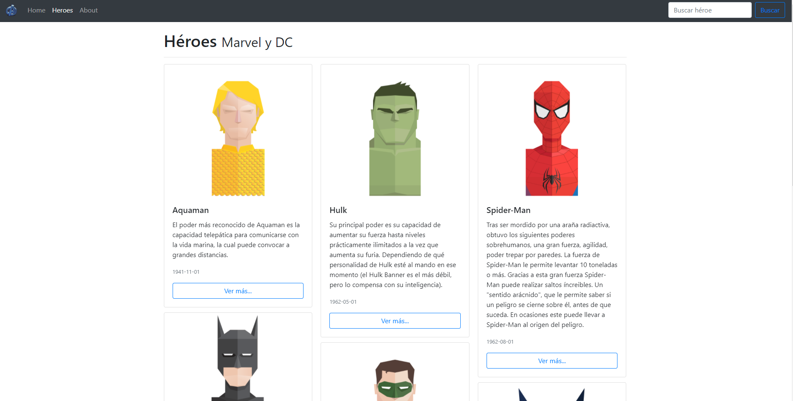

# SPA Comic-APP

Este proyecto se generó con [Angular CLI] (https://github.com/angular/angular-cli) versión 11.0.6.

## Modulos de Node:
Una vez clonado el proyecto nos movemos al interior de la carpeta del proyecto para descargar las dependencias necesarias.
```
npm install
```

## Servidor de desarrollo

Ejecute el siguiente comando para un servidor de desarrollo. 
```
ng serve
```
Vaya a `http://localhost:4200/`. La aplicación se recargará automáticamente si cambia alguno de los archivos de origen.

## Construir

Los artefactos de construcción se almacenarán en el directorio `dist/`. Utilice la marca `--prod` para una compilación de producción.
```
ng build
```

## Ayuda adicional

Para obtener más ayuda sobre Angular CLI, use `ng help` o consulte la página [Descripción general y referencia de comandos de Angular CLI] (https://angular.io/cli).


