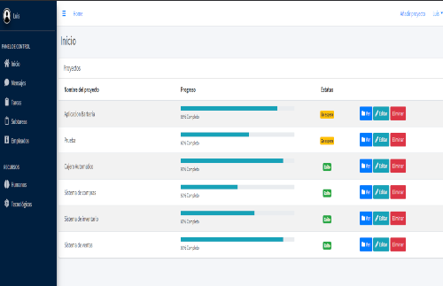

## Gestión de proyectos

Aplicación en Laravel para la gestion de proyectos

## Modulos de Node:
Una vez clonado el proyecto nos movemos al interior de la carpeta del proyecto para descargar las dependencias necesarias.
```
npm install
```

## Vista Previa

